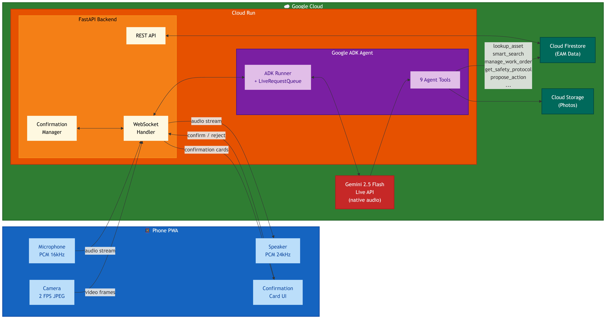

# Maintenance-Eye

**Real-time AI Co-Pilot for Physical Infrastructure Maintenance**

Point your phone camera at equipment. Speak naturally. Your AI co-pilot sees, diagnoses, and acts.

[](https://google.github.io/adk-docs/)
[](https://ai.google.dev/)
[](https://cloud.google.com/run)
[](tests/)
[](terraform/)
[](LICENSE)

> **Category**: Live Agents -- Real-time audio + vision with barge-in interruption
>
> **Built for the** [Google Gemini Live Agent Challenge](https://ai.google.dev/competition/gemini-api-developer)

[Live Demo](https://maintenance-eye-swrz6daraq-uc.a.run.app)

---

## The Problem

Transit infrastructure maintenance -- escalators, switch machines, power transformers -- is high-stakes manual work. Technicians operate in noisy, hazardous environments with their hands occupied by tools and safety equipment.

The current workflow forces a painful cycle: **inspect visually, stop working, pull out a tablet, type findings into an Enterprise Asset Management (EAM) system, then resume work**. This "stop and type" friction leads to missed defects, incomplete maintenance records, and shortcuts on safety protocols.

EAM systems are powerful, but they demand focused data entry -- fundamentally incompatible with active fieldwork. Maintenance teams need an interface that works *with* them, not against them.

---

## The Solution

Maintenance-Eye replaces the "stop and type" cycle with a hands-free AI co-pilot that sees, listens, speaks, and acts in real time.

### Real-Time Visual Inspection

The AI sees through the phone camera at 2 FPS, identifying faults like corrosion, wear, cracks, leaks, and misalignment. Every finding gets a severity rating (P1 Critical through P5 Planned) with confidence scores and automatic EAM code classification (Problem Code / Fault Code / Action Code).

### Natural Voice Interaction with Barge-In

Bidirectional PCM audio streaming (16kHz in, 24kHz out) enables fully hands-free operation. Technicians speak naturally while working -- no "press to talk" button. Full barge-in interruption support means you can cut in mid-sentence and the agent stops immediately to listen.

### Agent Persona: "Max"

Max is a 20-year senior maintenance engineer -- professional, calm, safety-conscious, and concise. He speaks like a trusted colleague, not a chatbot. Field responses stay to 2-3 sentences because technicians are working, not reading.

### Human-in-the-Loop Safety

Critical actions go through 3-layer validation: the agent proposes an action, the technician confirms via a visual card on screen (Confirm / Reject / Correct), and post-execution verification ensures data integrity. The AI never creates a work order, escalates a priority, or closes a ticket without explicit human approval.

### ASR-Aware Intelligent Search

Speech-to-text splits equipment IDs unpredictably -- "ESC-SC-003" becomes "e s c s c zero zero three." The QueryEngine NLP layer normalizes ASR-transcribed IDs, expands domain synonyms ("vibration" also searches "noise," "shaking"), and resolves fuzzy matches. This makes voice-driven equipment lookup reliable in noisy field environments.

### Enterprise Dashboard

A 5-page data explorer provides full visibility into maintenance operations: Work Orders, Assets, Locations, Knowledge Base, and EAM Codes. Each page supports search, multi-criteria filtering, and responsive layout (sidebar nav on desktop, bottom nav on mobile).

---

## Architecture



The Phone PWA captures camera frames (2 FPS JPEG) and microphone audio (PCM 16kHz), streaming them via WebSocket to the FastAPI backend on Cloud Run. The ADK Runner forwards media to the Gemini 2.5 Flash Live API for real-time multimodal reasoning. The agent invokes 9 specialized tools to query Firestore, manage work orders, and enforce safety protocols. Responses stream back as PCM 24kHz audio, text transcripts, and confirmation cards.

---

## Agent Tools

The agent has 9 specialized tools -- this is not a wrapper around a single API call:

| Tool | Purpose | Example |
|------|---------|---------|
| `smart_search` | NLP-powered search across all entities with ASR normalization | "pump vibration", "wo 10234", "P1 open rolling stock" |
| `lookup_asset` | Retrieve full asset details by exact ID | "Look up ESC-SC-003" |
| `get_inspection_history` | Past inspections and recurring failure patterns | "Show me last 3 inspections for this escalator" |
| `search_knowledge_base` | Repair procedures, manuals, troubleshooting guides | "Escalator step chain lubrication procedure" |
| `manage_work_order` | Create, update, close, and search work orders | "Create P2 work order for handrail wear" |
| `get_safety_protocol` | PPE requirements, LOTO procedures, hazard warnings | "Safety protocol for high-voltage cabinet" |
| `generate_report` | Inspection reports with photos and recommendations | "Generate end-of-shift report" |
| `propose_action` | Human-in-the-loop confirmation for critical actions | Renders confirmation card in UI |
| `check_pending_actions` | View unconfirmed proposals awaiting decision | "Any pending confirmations?" |

---

## Tech Stack

| Layer | Technology |
|-------|------------|
| AI Model | Gemini 2.5 Flash (Live API) -- native audio model |
| Agent Framework | Google ADK (Agent Development Kit) v1.10 |
| Backend | Python 3.12 + FastAPI (fully async) |
| Frontend | Vanilla HTML/CSS/JS Progressive Web App |
| Database | Google Cloud Firestore |
| Storage | Google Cloud Storage |
| Hosting | Google Cloud Run (0-3 autoscaling instances) |
| CI/CD | Cloud Build + Artifact Registry + GitHub Actions |
| IaC | Terraform |
| Containerization | Docker (multi-stage build, Python 3.12-slim) |

---

## Try It

### Option 1: Live Demo (Recommended)

Open the live deployment on your phone:

1. Navigate to **https://maintenance-eye-swrz6daraq-uc.a.run.app**
2. Tap **Start Inspection**
3. Allow camera and microphone access
4. Point your camera at any equipment (or a photo of equipment on another screen)
5. Speak: *"What do you see? Are there any issues?"*
6. Try: *"Create a work order for this"* -- you will see a confirmation card appear
7. Try interrupting Max mid-sentence to test barge-in

### Option 2: Explore the Dashboard

1. Open the same URL on a desktop browser
2. Click **Dashboard** in the header
3. Browse the 5 data pages: Work Orders, Assets, Locations, Knowledge Base, EAM Codes
4. Try searching: *"pump vibration"* or filter by priority *P1*

### Option 3: Verify Cloud Deployment

```bash
# Health check
curl https://maintenance-eye-swrz6daraq-uc.a.run.app/health

# Readiness check (validates Firestore connectivity)
curl https://maintenance-eye-swrz6daraq-uc.a.run.app/readiness

# List assets via REST API
curl https://maintenance-eye-swrz6daraq-uc.a.run.app/api/assets?limit=5

# List work orders
curl https://maintenance-eye-swrz6daraq-uc.a.run.app/api/work-orders?limit=5
```

### What to Look For

- Real-time camera feed with scanning HUD overlay
- Natural voice responses from Max (native audio, not robotic TTS)
- Confirmation cards for critical actions (human-in-the-loop)
- Barge-in: interrupt Max mid-sentence and he stops immediately
- ASR intelligence: say equipment IDs naturally ("wo ten two three four") and Max resolves them

---

## Quick Start

### Prerequisites

- Python 3.12+
- Google Cloud SDK ([install](https://cloud.google.com/sdk/docs/install))
- A GCP project with billing enabled
- Gemini API key from [AI Studio](https://aistudio.google.com/apikey)

### 1. Clone and configure

```bash
git clone https://github.com/sahaavi/Maintenance-Eye.git
cd Maintenance-Eye
cp .env.example .env
# Edit .env with your GCP project ID and Gemini API key
```

### 2. Install dependencies

```bash
cd backend
python3 -m venv venv
source venv/bin/activate  # On Windows: venv\Scripts\activate
pip install -r requirements.txt
```

### 3. Run locally

The backend automatically falls back to a JSON-based EAM service when Firestore is unavailable -- no cloud setup needed for local testing:

```bash
python3 main.py
# Open http://localhost:8080 on your phone (same network)
```

### 4. (Optional) Run with Firestore emulator

```bash
firebase emulators:start          # Firestore @ localhost:8081
FIRESTORE_EMULATOR_HOST=localhost:8081 python3 main.py
```

### 5. Seed synthetic data

```bash
python3 ../scripts/seed_data.py
```

### 6. Run tests

```bash
python3 -m pytest -o "addopts=" tests/unit/ -v   # 56 unit tests
```

---

## Deploy to Google Cloud

### One-command deployment

```bash
./scripts/deploy.sh <project-id> <gemini-api-key> [region]
```

This script enables required GCP APIs, creates an Artifact Registry repository, stores the API key in Secret Manager, builds the Docker image via Cloud Build, deploys to Cloud Run via Terraform, and grants Firestore IAM permissions. Data auto-seeds on first request.

### Manual Terraform deployment

```bash
cd terraform
terraform init
terraform apply \
  -var="project_id=YOUR_PROJECT" \
  -var="gemini_api_key=YOUR_KEY" \
  -var="region=us-central1"
```

---

## Project Structure

```
Maintenance-Eye/
├── backend/
│   ├── main.py                    # FastAPI entry point
│   ├── config.py                  # Environment configuration
│   ├── api/
│   │   ├── routes.py              # REST endpoints
│   │   ├── websocket.py           # WebSocket handler (Live + Chat modes)
│   │   └── websocket_helpers.py   # Confirmation & media card helpers
│   ├── agent/
│   │   ├── maintenance_agent.py   # ADK agent definition
│   │   ├── prompts.py             # System prompts & Max persona
│   │   └── tools/                 # 9 ADK tool functions
│   ├── middleware/
│   │   └── security.py            # Security headers middleware
│   ├── services/
│   │   ├── eam_interface.py       # Abstract EAM service interface
│   │   ├── base_eam.py            # Shared search helpers
│   │   ├── json_eam.py            # JSON file fallback (local dev)
│   │   ├── firestore_eam.py       # Firestore implementation (production)
│   │   ├── query_engine.py        # NLP pre-query intelligence layer
│   │   ├── search_matcher.py      # Token-aware text matching
│   │   ├── confirmation_manager.py # Human-in-the-loop action tracking
│   │   └── seeder.py              # Firestore data seeder
│   └── models/
│       └── schemas.py             # Pydantic data models
├── frontend/
│   ├── index.html                 # PWA entry (3 screens: splash, inspection, dashboard)
│   ├── style.css                  # Enterprise dashboard styles
│   ├── app.js                     # Client: WebSocket, camera, mic, audio playback, UI
│   ├── sw.js                      # Service worker (offline caching)
│   └── manifest.json              # PWA manifest
├── tests/                         # Unit, integration, security & E2E tests
├── data/                          # Seed data (125 assets, 145 WOs, 85 EAM codes)
├── terraform/                     # Infrastructure as Code (Cloud Run + IAM)
├── scripts/                       # Deployment, seeding & test scripts
├── docs/                          # Architecture diagram
├── .github/workflows/             # CI pipeline (lint, security, tests)
├── Dockerfile                     # Multi-stage container build
├── cloudbuild.yaml                # Cloud Build CI/CD config
└── .env.example                   # Environment variable template
```

---

## Google Cloud Services

| Service | Role |
|---------|------|
| **Gemini 2.5 Flash** (Live API) | Real-time multimodal AI with native audio -- the agent's brain |
| **Google ADK** | Agent framework with tool orchestration, session management, LiveRequestQueue |
| **Cloud Run** | Serverless container hosting with autoscaling (0-3 instances) and session affinity |
| **Cloud Firestore** | NoSQL database for assets, work orders, inspections, EAM codes, knowledge base |
| **Cloud Storage** | Inspection photos and generated PDF reports |
| **Cloud Build** | CI/CD pipeline -- builds Docker images on push |
| **Artifact Registry** | Docker image repository |
| **Secret Manager** | Secure API key storage |

---

## How I Built It

### The Bidirectional Streaming Core

The heart of Maintenance-Eye is a persistent WebSocket connection handling audio, video, and tool calls simultaneously. The ADK Runner with `LiveRequestQueue` bridges the mobile PWA to the Gemini Live API. Upstream: PCM 16kHz audio and JPEG frames stream into the ADK. Downstream: PCM 24kHz audio, text transcripts, rich media cards, and confirmation cards stream back to the technician.

### The ASR Challenge (Key Innovation)

Speech-to-text splits equipment IDs unpredictably -- "ESC-SC-003" becomes "e s c s c zero zero three." I built a QueryEngine NLP layer that normalizes ASR-transcribed IDs, expands domain synonyms, and resolves fuzzy matches against the EAM database. A companion `SearchMatcher` handles token-aware text matching with ASR domain corrections, making voice-driven equipment lookup reliable in noisy field environments.

### Human-in-the-Loop Safety (Key Design Decision)

Safety-critical work order creation requires multi-layered validation. I enforce required fields at three independent checkpoints: proposal (agent calls `propose_action`), tool execution (confirmation card rendered in UI), and post-confirmation automation (data integrity verification). No single layer can be bypassed. This design was modeled after real SkyTrain maintenance operations across 6 departments with P1-P5 priority classification.

### What I Learned

- Native audio models need specific PCM sample rate matching (16kHz input, 24kHz output) -- mismatches produce silence or garbled audio
- ADK `send_realtime(blob)` takes a single positional argument, not a keyword argument -- subtle API detail that caused debugging time
- Firestore emulator is essential for rapid iteration without cloud costs
- A vanilla JS PWA avoids build-step complexity while delivering a full mobile experience with camera, microphone, and offline caching

---

## Domain Context

Modeled after SkyTrain maintenance operations with 6 departments: Rolling Stock, Guideway, Power, Signal & Telecom, Facilities, and Elevating Devices. The EAM data model follows industry-standard classification: Problem Code, Fault Code, and Action Code. Priorities range from P1 (critical safety) through P5 (planned maintenance). The seed dataset includes 125 assets, 145 work orders, 85 EAM codes, 45 inspection records, and 27 knowledge base entries.

---

## What's Next

- **Production EAM integration**: The abstract `EAMService` interface is designed for plug-in backends -- Hexagon EAM, SAP PM, and Maximo are next
- **Multi-language support**: Diverse maintenance teams need inspection in their working language
- **Offline-first PWA**: Underground tunnels and remote substations have no connectivity -- queue inspections for sync
- **Multi-agent architecture**: Specialized sub-agents for electrical, mechanical, and structural domains
- **Predictive analytics**: Identify failure trends from historical inspection patterns before equipment breaks

---

## License

MIT License -- See [LICENSE](LICENSE)

Copyright (c) 2026 Avishek Saha
