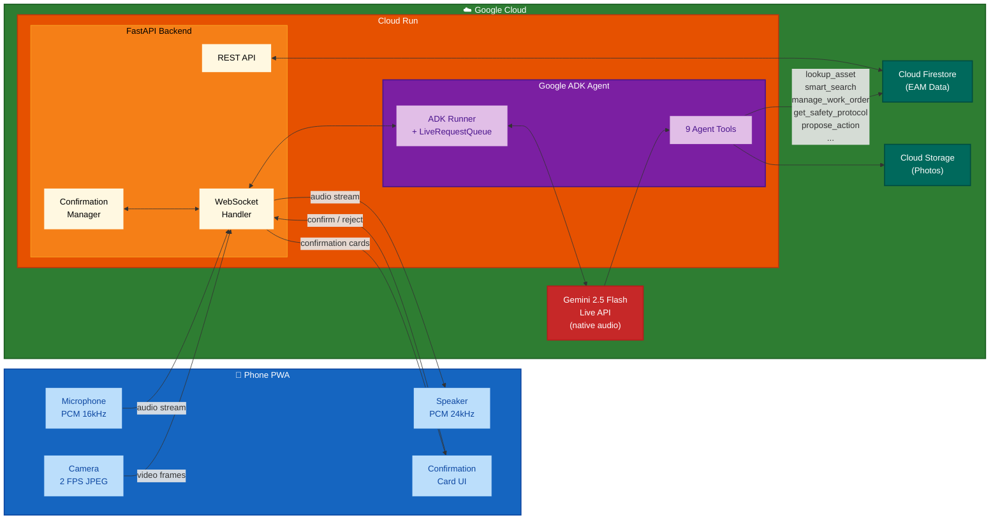

# Maintenance-Eye Architecture Diagram

Copy the Mermaid code below into [mermaid.live](https://mermaid.live) to render and export as PNG for the video.

## How to export

1. Go to [mermaid.live](https://mermaid.live)
2. Paste the Mermaid code above (everything between the triple backticks)
3. Adjust theme if needed (try "dark" for a video-friendly background)
4. Click the download PNG button (or SVG)
5. Use the exported image in your video during the Architecture section (ACT 4, ~3:05-3:45)
